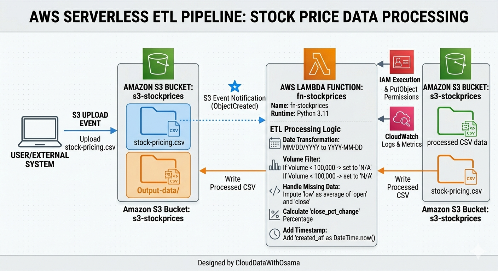

# aws-s3-lambda-stock-etl

An event-driven serverless ETL pipeline built with **AWS S3** and **Lambda** to automate the processing of stock pricing data. The pipeline triggers on file uploads to ingest CSV data, performs automated cleaning and executes feature engineering to calculate financial metrics before storing the processed output back in S3.




## 🛠 Tech Stack

*  **Cloud Provider:** AWS (S3, Lambda) 


*  **Runtime:** Python 3.11 


*  **Libraries:** `boto3`, `csv`, `json`, `io`, `datetime` 


## 📂 S3 Bucket Configuration

The project utilizes a single bucket named `s3-stockprices` with the following folder structure :

*  **`Input-data/`**: Landing zone for raw `stock-pricing.csv` files .


*  **`Output-data/`**: Destination for processed and transformed datasets.


## ⚙️ Lambda Setup & Trigger

The Lambda function, named `fn-stockprices`, is configured to trigger automatically whenever a `.csv` file is uploaded to the `Input-data/` prefix.

### IAM Permissions

The function requires an execution role with the following inline policy to read from and write to the S3 bucket:

```json
{
    "Version": "2012-10-17",
    "Statement": [
        {
            "Sid": "S3AccessPermissions",
            "Effect": "Allow",
            "Action": [
                "s3:GetObject",
                "s3:PutObject",
                "s3:ListBucket"
            ],
            "Resource": [
                "arn:aws:s3:::s3-stockprices",
                "arn:aws:s3:::s3-stockprices/*"
            ]
        }
    ]
}

```


## 🔄 ETL Logic & Transformations

The Python script `lamda_fnction.py` processes each row of the CSV to ensure data quality and generate new features:

1.  **Date Standardization**: Converts dates from `MM/DD/YYYY` to `YYYY-MM-DD` format .


2.  **Volume Filtering**: If the trading volume is less than 100,000, it is marked as `'N/A'` .


3.  **Data Imputation**: If the `low` price is recorded as 0, it is replaced by the average of the `open` and `close` prices .


4.  **Percentage Change**: Calculates the daily return using the formula: $(((Close - Open) / Open) * 100)$.


5.  **Audit Columns**: Adds a `created_at` timestamp to every processed record.


## 🧪 Testing and Validation

The pipeline was validated using the **Amazon S3 Put** test template.

*  **Test Event Name**: `SPTE` 


*  **Input File**: `Input-data/stock_pricing.csv` 


*  **Expected Result**: A status code of 200 and a success message indicating the file was uploaded to the output folder .


### Execution Logs

The function successfully processed the data with a duration of approximately 4093 ms using 94 MB of memory.

---

**Author:** CloudDataWithOsama